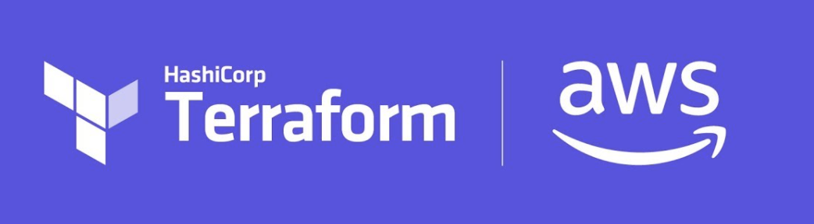

# K8S Cloud


[](https://github.com/wsalles/k8s-cloud/actions/workflows/ci.yml)




### Getting Started

This is a simple project using EKS on AWS.

Please, make sure that you have some requirements, like:
- **aws-cli** => `pip install awscli`
- **kubectl** => `https://kubernetes.io/docs/tasks/tools/#kubectl`

So let's go!

## Steps on AWS

1) First, we need access the folder `aws` and then, do:

```sh
make dev create-workspace
```

2) Show all the changes that will be made:

```sh
make plan
```

3) If you're right, do:
```sh
make apply
```

> Obs: both this target, and the **plan**, are doing: **init**, **validate** and **fmt**


* * *

## Steps on Kubernetes

If everything goes well, we can move on:

1) Adding Kubernetes Cluster context

Now, you need to go back one level in your directory and access the kubernetes folder:

```bash
make context-config
```

2) In this step, you need to install EBS CSI Driver and then, you can deploy it:

```bash
make ebs-install

make ebs-config
```

3) Now, we let's deploy the `metric-server` and `traefik`:

```bash
make setup
```

4) Ok, finally you need to deploy a app, for this, do:

```bash
make deploy
```

If you need to delete, just do: `make delete`


* * *

### :x: Remember to destroy everything if you don't need it anymore.

To do this, go back to the AWS folder and do:

```bash
make destroy
```

* * *

## Author

**Wallace Salles**

* Website: https://wallacesalles.dev
* LinkedIn: https://www.linkedin.com/in/wallacesalles/

* * *

# Credits

- https://registry.terraform.io/providers/hashicorp/aws/latest/docs
- https://doc.traefik.io/traefik/v1.7/user-guide/kubernetes/
- https://github.com/kubernetes-sigs/metrics-server
- https://www.nanoshots.com.br/
- https://tonylixu.medium.com/infra-as-code-terraform-4-add-new-ebs-volume-to-aws-eks-cluster-857818523d73
